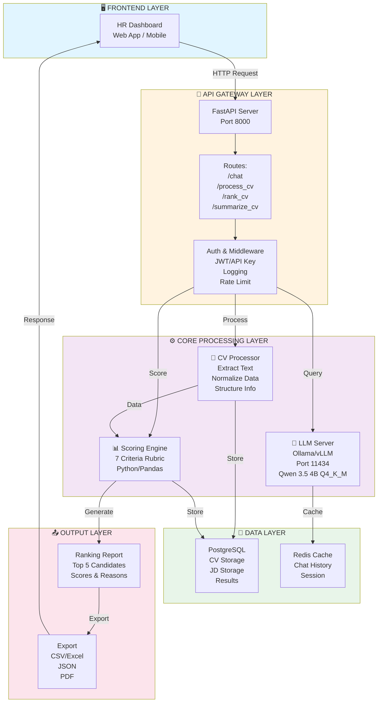

# LLM ENGINE CHO HRM - BÁO CÁO TỔNG HỢP

---

## 📊 BẢNG TÓM TẮT DỰ ÁN

| Tiêu Chí | Chi Tiết |
|----------|---------|
| **Tên Dự Án** | LLM Engine cho HRM (Tuyển Dụng & Đánh Giá CV) |
| **Mục Tiêu** | Xây dựng hệ thống tự động hóa lọc CV, chấm điểm, xếp hạng ứng viên cho vị trí AI/Robotics |
| **Model Chính** | Qwen 3.5 (4B Q4_K_M cho MVP, 27B/35B-A3B cho production) |
| **Công Nghệ Stack** | Ollama, FastAPI, vLLM, Python, Pandas, Docker |
| **Thời Gian Dự Kiến** | **7-10 ngày** (MVP: 3 ngày, Tối ưu: 4-7 ngày) |
| **Đầu Ra Chính** | API server, Dashboard chấm điểm, Top 5 ứng viên, Docker image |
| **Đối Tượng Sử Dụng** | Bộ phận HR, Tuyển dụng, Đào tạo |
| **Lợi Ích** | Giảm 80% thời gian sàng lọc CV, tăng tính công bằng, dễ mở rộng |

---

## 🏗️ KIẾN TRÚC TỔNG THỂ



---

## ⏱️ TIMELINE CHI TIẾT (3 NGÀY - MVP)

### **NGÀY 1: HOST MODEL + API GATEWAY**

| Thời Gian | Công Việc | Kết Quả | Thời Lượng |
|-----------|-----------|---------|-----------|
| 08:00-09:00 | Host Qwen 3.5 4B trên Ollama | Model chạy port 11434 | 1h |
| 09:00-12:00 | Xây API Gateway (FastAPI) | /chat, /health endpoints | 3h |
| 12:00-13:00 | Lunch break | - | 1h |
| 13:00-15:00 | Thêm route /process_cv | CV processing endpoint | 2h |
| 15:00-17:00 | Test API, fix bugs | API hoạt động ổn định | 2h |

**Kết quả Ngày 1:** API server chạy, có thể gọi model ✅

---

### **NGÀY 2: XỬ LÝ DỮ LIỆU + CHUẨN HÓA**

| Thời Gian | Công Việc | Kết Quả | Thời Lượng |
|-----------|-----------|---------|-----------|
| 08:00-10:00 | Tải 500 CV từ Google Drive | 500 CV ở data/raw_cvs | 2h |
| 10:00-11:00 | Giải nén + xử lý PDF/DOCX | cvs_extracted.jsonl | 1h |
| 11:00-12:00 | Xử lý file .url (Selenium) | CV từ TopCV | 1h |
| 12:00-13:00 | Lunch break | - | 1h |
| 13:00-16:00 | Chuẩn hóa CV (normalize_cv.py) | cvs_normalized.csv | 3h |
| 16:00-17:00 | Kiểm tra dữ liệu | 100% CV được xử lý | 1h |

**Kết quả Ngày 2:** 500 CV chuẩn hóa, sẵn sàng chấm điểm ✅

---

### **NGÀY 3: CHẤM ĐIỂM + TOP 5 + DEMO**

| Thời Gian | Công Việc | Kết Quả | Thời Lượng |
|-----------|-----------|---------|-----------|
| 08:00-09:00 | Định nghĩa 7 tiêu chí (rubric.json) | Rubric hoàn chỉnh | 1h |
| 09:00-11:00 | Chạy score_all_cvs.py | cvs_scored.csv | 2h |
| 11:00-12:00 | Xuất top 5 ứng viên | Top 5 report | 1h |
| 12:00-13:00 | Lunch break | - | 1h |
| 13:00-14:00 | Tạo test suite | test_suite.py | 1h |
| 14:00-15:30 | Test API + scoring | Verify kết quả | 1.5h |
| 15:30-17:00 | Chuẩn bị demo + documentation | README, demo script | 1.5h |

**Kết quả Ngày 3:** MVP hoàn chỉnh, top 5 ứng viên, sẵn sàng demo ✅

---

## 📊 TỔNG HỢP 3 NGÀY

| Giai Đoạn | Kết Quả | Status |
|-----------|---------|--------|
| **Ngày 1** | API Gateway chạy được | ✅ |
| **Ngày 2** | 500 CV chuẩn hóa | ✅ |
| **Ngày 3** | Top 5 ứng viên + Demo | ✅ |
| **Tổng** | MVP LLM Engine hoàn chỉnh | ✅

---

## 📋 CHECKLIST TRIỂN KHAI

### **PHASE 1: SETUP & INFRASTRUCTURE**

- [ ] Cài đặt Ollama trên máy
- [ ] Tải model Qwen 3.5 4B Q4_K_M
- [ ] Kiểm tra Ollama server chạy trên port 11434
- [ ] Cài đặt Python 3.8+, pip packages (FastAPI, Uvicorn, Pandas, PyPDF2, python-docx)
- [ ] Tạo thư mục project: `data/raw_cvs`, `data/output`

### **PHASE 2: DATA COLLECTION & PROCESSING**

- [ ] Tải 500 CV từ Google Drive
- [ ] Giải nén file ZIP
- [ ] Xử lý file PDF/DOCX (trích text)
- [ ] Xử lý file .url (tải từ TopCV bằng Selenium)
- [ ] Lưu dữ liệu thô: `cvs_extracted.jsonl`

### **PHASE 3: DATA NORMALIZATION**

- [ ] Chạy `normalize_cv.py` để trích thông tin CV
- [ ] Kiểm tra dữ liệu: tên, chuyên ngành, GPA, kỹ năng, project, kinh nghiệm
- [ ] Lưu CSV chuẩn hóa: `cvs_normalized.csv`
- [ ] Xác nhận 100% CV được xử lý

### **PHASE 4: SCORING & RANKING**

- [ ] Định nghĩa 7 tiêu chí chấm điểm (rubric.json)
- [ ] Chạy `score_all_cvs.py` với logic 7 tiêu chí
- [ ] Kiểm tra điểm số hợp lý (0-10)
- [ ] Xếp hạng: Shortlist / Borderline / Reject
- [ ] Lưu kết quả: `cvs_scored.csv`
- [ ] Xuất top 5 ứng viên

### **PHASE 5: API DEVELOPMENT**

- [ ] Tạo `api_gateway.py` với FastAPI
- [ ] Implement route `/chat` (gọi Ollama)
- [ ] Implement route `/process_cv` (xử lý CV)
- [ ] Implement route `/health` (kiểm tra server)
- [ ] Thêm error handling & logging
- [ ] Test API bằng cURL / Postman

### **PHASE 6: PROMPT ENGINEERING**

- [ ] Tạo prompt template cho tóm tắt CV
- [ ] Tạo prompt template cho chấm điểm CV
- [ ] Tạo prompt template cho match CV-JD
- [ ] Kiểm tra output format (JSON)
- [ ] Tối ưu prompt để tăng độ ổn định

### **PHASE 7: TESTING & EVALUATION**

- [ ] Tạo test suite (`test_suite.py`)
- [ ] Test 10 CV mẫu
- [ ] Đo latency, token/s, fail rate
- [ ] Kiểm tra format output
- [ ] Kiểm tra không có ảo giác
- [ ] Tạo eval report

### **PHASE 8: FINE-TUNING (OPTIONAL)**

- [ ] Chuẩn bị training data (100-200 mẫu)
- [ ] Cài đặt TRL, PEFT, bitsandbytes
- [ ] Chạy SFTTrainer với LoRA
- [ ] Đánh giá model fine-tuned
- [ ] So sánh với model gốc

### **PHASE 9: DEPLOYMENT**

- [ ] Tạo `Dockerfile` cho API
- [ ] Tạo `docker-compose.yml` (Ollama + API)
- [ ] Build Docker image
- [ ] Test Docker container
- [ ] Tạo `.env.example`
- [ ] Viết README chi tiết

### **PHASE 10: DOCUMENTATION & DEMO**

- [ ] Viết API documentation
- [ ] Tạo demo script
- [ ] Chuẩn bị slide trình bày
- [ ] Tạo video demo (nếu cần)
- [ ] Bàn giao cho team

---

## 🎯 PLAN TRIỂN KHAI

### **PLAN A: NHANH (3 NGÀY - MVP)**

**Ưu điểm:** Nhanh, có kết quả sớm
**Nhược điểm:** Chưa tối ưu, chưa fine-tune

```
Ngày 1: Host model + API gateway
Ngày 2: Xử lý 500 CV + chuẩn hóa
Ngày 3: Chấm điểm + chọn top 5
```

**Kết quả:** API chạy, top 5 ứng viên

---

### **PLAN B: CÂN BẰNG (7 NGÀY - RECOMMENDED)**

**Ưu điểm:** Đủ tối ưu, có test, có Docker
**Nhược điểm:** Không fine-tune

```
Ngày 1-3: MVP (như Plan A)
Ngày 4-5: Thêm prompt, test, Docker
Ngày 6-7: Eval, documentation, demo
```

**Kết quả:** Production-ready engine, Docker image

---

### **PLAN C: HOÀN CHỈNH (10 NGÀY - PREMIUM)**

**Ưu điểm:** Đầy đủ, có fine-tune, có monitoring
**Nhược điểm:** Tốn thời gian

```
Ngày 1-7: Plan B
Ngày 8-9: Fine-tune model
Ngày 10: Monitoring, logging, advanced features
```

**Kết quả:** Enterprise-ready engine, fine-tuned model

---

## 📈 METRICS & KPI

| Metric | Target | Cách Đo |
|--------|--------|---------|
| **Accuracy** | >85% | So sánh top 5 với HR decision |
| **Latency** | <5s/CV | Đo từ API log |
| **Throughput** | >100 CV/phút | Tính từ processing time |
| **Uptime** | >99% | Monitor server |
| **Cost** | <$100/tháng | Tính từ resource usage |

---

## 🚀 RISK & MITIGATION

| Risk | Impact | Mitigation |
|------|--------|-----------|
| **Model ảo giác** | Chấm điểm sai | Thêm validation, prompt engineering |
| **PDF bị mã hóa** | Không trích được text | Dùng OCR (Tesseract) |
| **TopCV token hết hạn** | Không tải được CV | Dùng Selenium, retry logic |
| **RAM không đủ** | Model crash | Dùng model nhỏ hơn (3B) |
| **API timeout** | Request fail | Thêm timeout handling, queue |

---

## 💡 KHUYẾN NGHỊ

1. **Bắt đầu với Plan B (7 ngày)** - Cân bằng giữa tốc độ và chất lượng
2. **Ưu tiên data quality** - 80% thời gian cho xử lý dữ liệu
3. **Test sớm, test thường xuyên** - Không chờ đến cuối
4. **Dùng Docker từ đầu** - Dễ deploy, dễ scale
5. **Lưu lại mọi kết quả** - Để so sánh, evaluate

---

## 📞 CONTACT & SUPPORT

- **Lead:** [Tên Lead]
- **Tech Lead:** [Tên Tech Lead]
- **Slack Channel:** #hrm-llm-engine
- **Repository:** [GitHub Link]
- **Documentation:** [Wiki Link]

---

**Ngày Cập Nhật:** 24/03/2026
**Trạng Thái:** Sẵn sàng triển khai
**Phê Duyệt:** _______________
